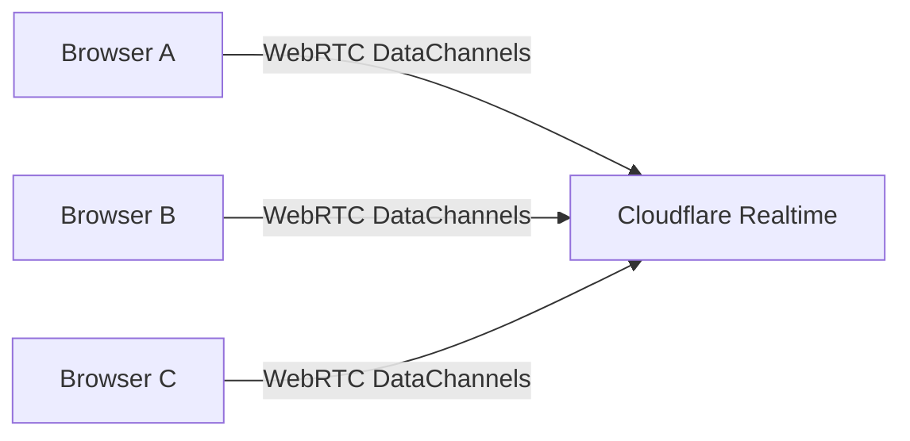

# Architecture Overview

This project evaluated three possible backend architectures.

## Option 1: Custom WebRTC Signaling Server (Rust + Workers)

### Stack

* Rust backend
* Cloudflare Workers
* WebRTC P2P

### Responsibilities

Backend must handle:

* room creation
* signaling exchange (offer/answer)
* ICE candidate relay

### Pros

* Fully controlled infrastructure
* Pure peer-to-peer topology
* Maximum flexibility

### Cons

* High implementation complexity
* Requires maintaining signaling logic
* Harder to scale

---

## Option 2: Cloudflare Workers + Durable Objects (Managed Signaling)

### Stack

* Rust Workers
* Durable Objects for room state
* WebRTC P2P

### Pros

* Serverless scaling
* Strong room lifecycle control
* Good for multi-user rooms

### Cons

* Still requires custom WebRTC signaling logic
* More backend code to maintain

---

## Option 3: Cloudflare Realtime (Managed WebRTC Infrastructure)

### Stack

* GitHub Pages frontend
* Cloudflare Realtime for transport
* Optional Durable Objects for metadata

### Responsibilities handled by Cloudflare

* WebRTC signaling
* NAT traversal (STUN/TURN)
* Media/data routing

### Pros

* Minimal backend code
* Global low-latency infrastructure
* Built-in scalability
* Faster development

### Cons

* Not pure P2P topology
* Requires using Cloudflare’s session model

---

## Recommended Architecture

**Cloudflare Realtime is the recommended infrastructure for Cryt.** ✅

### Reasoning

This project prioritizes:

* rapid development
* minimal infrastructure maintenance
* global reliability
* experimental features over strict decentralization

Cloudflare Realtime removes the need to build:

* signaling servers
* ICE candidate handling
* TURN fallback logic

This allows the project to focus on:

* encoding layers
* cryptography
* user experience

---

## Final System Architecture

**Transport:**

* WebRTC DataChannels via Cloudflare SFU

**Storage:**

* none (ephemeral)
