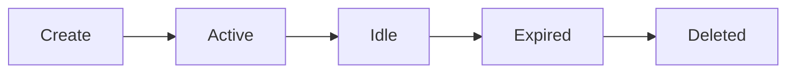

# Room Lifecycle

## Expiration Rules

* **Idle**: No messages for 5 minutes.
* **Expired**: Room marked for deletion after 5-10 minutes of inactivity.
* **Deleted**: State removed from Durable Object (if used) or session ends.

**No message logs are retained at any point.**
