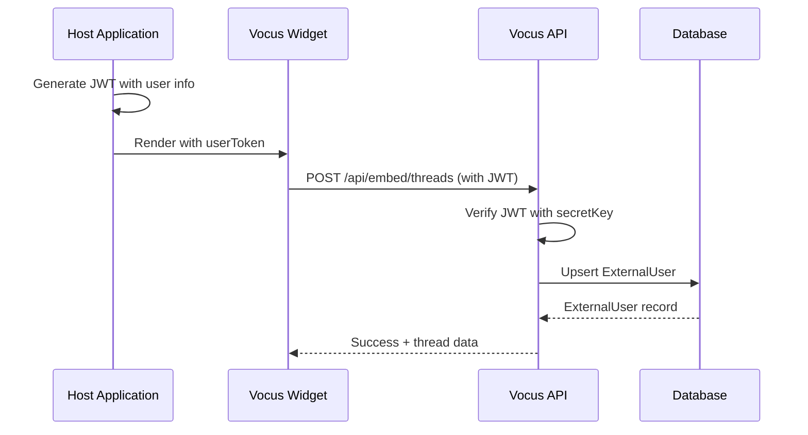
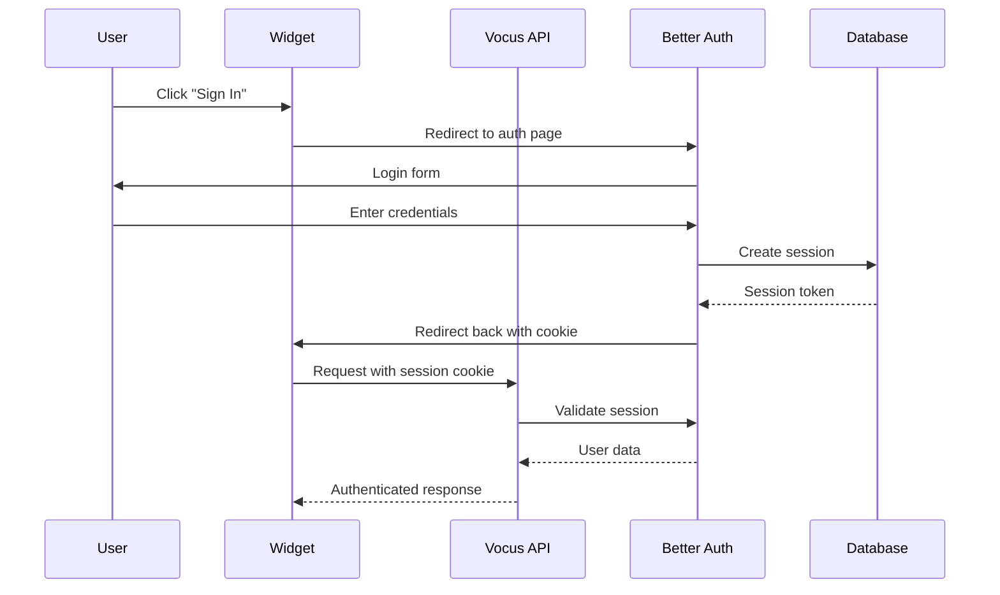
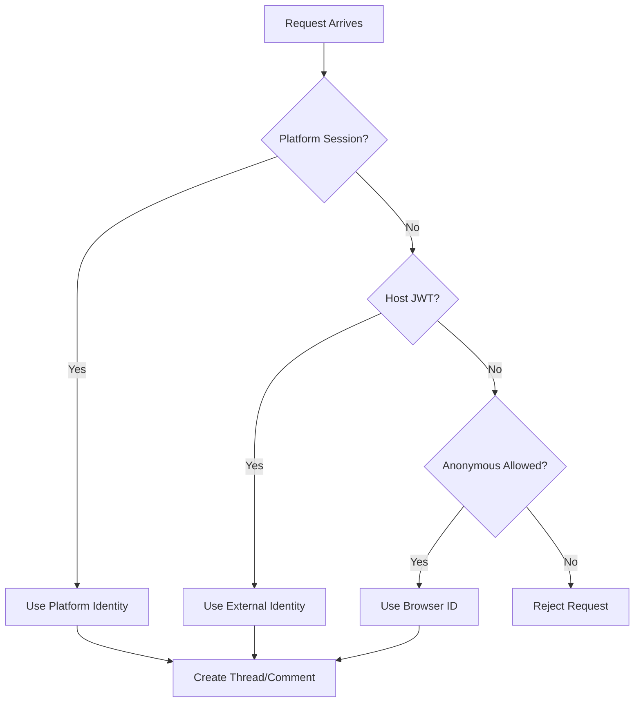
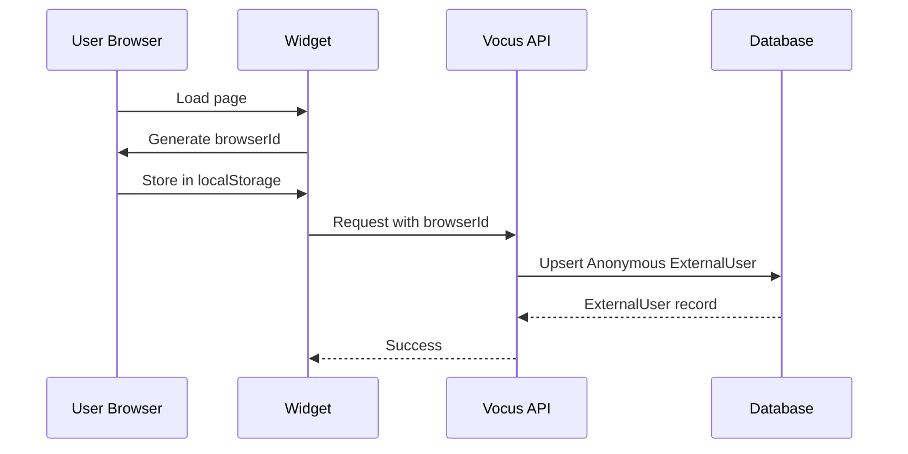

# Authentication Modes

Vocus supports four authentication modes to fit different integration scenarios.

## Overview

| Mode          | Use Case                | Complexity | Security |
| ------------- | ----------------------- | ---------- | -------- |
| HOST_SSO      | Existing user base      | Medium     | High     |
| PLATFORM_AUTH | Vocus-managed users     | Low        | High     |
| HYBRID        | Flexible authentication | Medium     | High     |
| ANONYMOUS     | Public feedback         | Low        | Medium   |

## HOST_SSO Mode

### When to Use

- You have an existing authentication system
- Users are already logged into your application
- You want seamless single sign-on
- You need to track user identity across sessions

### How It Works



### JWT Payload

```typescript
interface HostJwtPayload {
  sub?: string; // Primary: User ID
  id?: string; // Alternative: User ID
  externalId?: string; // Alternative: User ID
  email?: string;
  name?: string;
  avatarUrl?: string;
  emailVerified?: boolean;
  iss?: string; // Issuer (validated if configured)
  aud?: string; // Audience (validated if configured)
  exp?: number; // Expiration (always validated)
}
```

### Implementation

**Host Application (Node.js example):**

```typescript
import { SignJWT } from "jose";

const secretKey = new TextEncoder().encode("sk_your_secret_key");

async function generateUserToken(user) {
  return new SignJWT({
    sub: user.id,
    email: user.email,
    name: user.name,
    avatarUrl: user.avatarUrl,
    emailVerified: user.emailVerified,
  })
    .setProtectedHeader({ alg: "HS256" })
    .setIssuedAt()
    .setExpirationTime("24h")
    .setIssuer("your-app")
    .setAudience("vocus")
    .sign(secretKey);
}
```

**Widget Integration:**

```html
<script>
  window.VocusWidget?.init({
    publicKey: "pk_project_key",
    userToken: "<%= userToken %>", // Server-rendered JWT
    container: "#vocus-widget",
  });
</script>
```

### ExternalUser Upsert

Automatic user synchronization:

```typescript
// packages/server/services/externalUserService.ts

export const upsertExternalUserFromToken = async (input) => {
  const payload = await verifyHostJwt(input.token, input.secretKey);
  const externalId = payload.sub ?? payload.externalId ?? payload.id;

  return externalUserRepository.upsertByExternalId({
    projectId: input.projectId,
    externalId,
    email: payload.email ?? null,
    name: payload.name ?? null,
    avatarUrl: payload.avatarUrl ?? null,
    emailVerified: payload.emailVerified ?? false,
    authProvider: AuthMode.HOST_SSO,
  });
};
```

**Upsert Behavior:**

- Match on `{projectId, externalId}`
- Update: `email`, `name`, `avatarUrl`, `emailVerified`, `lastSeenAt`
- Create if not exists
- Always update `lastSeenAt`

## PLATFORM_AUTH Mode

### When to Use

- No existing authentication system
- Want Vocus to manage user accounts
- Simpler integration
- Users don't need to log in to host app

### How It Works



### Configuration

```json
{
  "authMode": "PLATFORM_AUTH",
  "allowAnonymous": false
}
```

### Usage

Users authenticate directly with Vocus:

```typescript
// API automatically checks session
const session = await getPlatformSession(headers);

if (!session) {
  throw unauthorized("Platform session required");
}

// User is authenticated
return { identity: { kind: "platform", userId: session.user.id } };
```

## HYBRID Mode

### When to Use

- Want maximum flexibility
- Some users have host accounts, others don't
- Gradual migration from anonymous to authenticated
- Best user experience

### How It Works



### Priority Order

1. **Platform Session** (highest priority)
2. **Host JWT** (fallback)
3. **Anonymous** (if enabled)
4. **Reject** (if nothing available)

### Implementation

```typescript
// packages/server/domain/identity.ts

if (authMode === AuthMode.HYBRID) {
  // 1. Try platform session
  if (session) {
    return {
      identity: { kind: "platform", userId: session.user.id },
      identityKey: { key: session.user.id, source: "platform" },
    };
  }

  // 2. Try host JWT
  if (token) {
    const externalUser = await upsertExternalUserFromToken({
      projectId,
      secretKey,
      token,
    });

    return {
      identity: {
        kind: "external",
        externalUserId: externalUser.id,
        provider: externalUser.authProvider,
      },
      identityKey: { key: externalUser.id, source: "external" },
    };
  }

  // 3. Try anonymous
  if (allowAnonymous && browserId) {
    const externalUser = await upsertAnonymousExternalUser({
      projectId,
      browserId,
    });

    return {
      identity: {
        kind: "external",
        externalUserId: externalUser.id,
        provider: AuthMode.ANONYMOUS,
        browserId,
      },
      identityKey: { key: browserId, source: "browser" },
    };
  }

  // 4. Reject
  throw unauthorized("Authentication required");
}
```

### Example Scenarios

**Scenario 1: Logged-in Host User**

```javascript
// User is logged into host app
const token = await generateUserToken(currentUser);

window.VocusWidget?.init({
  publicKey: "pk_xxx",
  userToken: token, // Host JWT
});

// Result: ExternalUser identity with full profile
```

**Scenario 2: Anonymous Visitor**

```javascript
// User not logged in
window.VocusWidget?.init({
  publicKey: "pk_xxx",
  // No userToken
});

// Result: Anonymous identity with browser ID
```

**Scenario 3: Platform Admin**

```javascript
// Admin logged into Vocus platform
window.VocusWidget?.init({
  publicKey: "pk_xxx",
  // Platform session cookie present
});

// Result: Platform user identity
```

## ANONYMOUS Mode

### When to Use

- Public feedback boards
- No authentication required
- Low-security scenarios
- Maximum participation

### How It Works



### Browser ID Management

```typescript
// Widget generates and stores browser ID
const STORAGE_KEY = "vocus_browser_id";

function getBrowserId() {
  try {
    const existing = localStorage.getItem(STORAGE_KEY);
    if (existing) return existing;

    const value = crypto.randomUUID();
    localStorage.setItem(STORAGE_KEY, value);
    return value;
  } catch (error) {
    // Fallback if localStorage unavailable
    return `anon_${Math.random().toString(36).slice(2)}`;
  }
}
```

### Configuration

```json
{
  "authMode": "ANONYMOUS",
  "allowAnonymous": true
}
```

### Limitations

- No cross-device tracking
- Identity lost if cookies cleared
- Limited moderation capabilities
- Easier to spam (mitigated by rate limiting)

### Rate Limiting

Stricter limits for anonymous users:

```typescript
enforceRateLimit(`write:thread:${projectId}:${browserId}`, {
  windowMs: 60_000,
  max: 5, // Lower limit for anonymous
});
```

## Auth Mode Comparison

### Feature Matrix

| Feature             | HOST_SSO | PLATFORM_AUTH | HYBRID   | ANONYMOUS    |
| ------------------- | -------- | ------------- | -------- | ------------ |
| User Identity       | Full     | Full          | Full     | Browser only |
| Cross-device        | Yes      | Yes           | Yes      | No           |
| Email Notifications | Yes      | Yes           | Yes      | No           |
| Moderation          | Full     | Full          | Full     | Limited      |
| Setup Complexity    | Medium   | Low           | Medium   | Low          |
| Security            | High     | High          | High     | Medium       |
| User Experience     | Seamless | Redirect      | Flexible | Open         |

### Security Considerations

**HOST_SSO:**

- Strong identity verification
- JWT expiration validation
- Requires secure key management
- Must validate issuer/audience

**PLATFORM_AUTH:**

- Built-in session management
- Password hashing
- Email verification
- Additional auth system to maintain

**HYBRID:**

- Best of both worlds
- More complex logic
- Must handle all auth types

**ANONYMOUS:**

- No auth overhead
- Browser ID can be spoofed
- Requires strict rate limiting
- Limited moderation options

## Migration Between Modes

### Anonymous to HYBRID

```typescript
// User starts anonymous, then logs in
const browserId = getBrowserId();

// Later, user logs in
const token = await generateUserToken(user);

// Widget reinitializes with token
window.VocusWidget?.init({
  publicKey: "pk_xxx",
  userToken: token,
});

// Vocus now uses external identity instead of anonymous
```

### HOST_SSO to PLATFORM_AUTH

Requires data migration:

```typescript
// Migrate external users to platform users
const externalUsers = await prisma.externalUser.findMany({
  where: { authProvider: AuthMode.HOST_SSO },
});

for (const external of externalUsers) {
  // Create platform user
  const user = await prisma.user.create({
    data: {
      email: external.email,
      name: external.name,
    },
  });

  // Update threads/comments to new user
  await prisma.thread.updateMany({
    where: { createdByExternalId: external.id },
    data: { createdByUserId: user.id, createdByExternalId: null },
  });
}
```

## Best Practices

### 1. Use HYBRID for Flexibility

```typescript
// Recommended for most cases
{
  authMode: "HYBRID",
  allowAnonymous: true
}
```

### 2. Always Validate JWT

```typescript
// Production configuration
VOCUS_HOST_JWT_ISSUER = "your-app";
VOCUS_HOST_JWT_AUDIENCE = "vocus";
```

### 3. Rotate Secret Keys

```typescript
// Generate new keys periodically
const { publicKey, secretKey } = generateProjectKeys();

// Update project
await projectRepository.update(projectId, { secretKey });
```

### 4. Monitor Auth Mode Usage

```typescript
// Track auth mode distribution
const authModeStats = await prisma.externalUser.groupBy({
  by: ["authProvider"],
  _count: true,
});
```

## Next Steps

- **[Data Model](./data-model.md)**: Database schema
- **[Security](./security.md)**: Security practices
- **[Widget SSO](../widgets/sso-integration.md)**: SSO implementation
