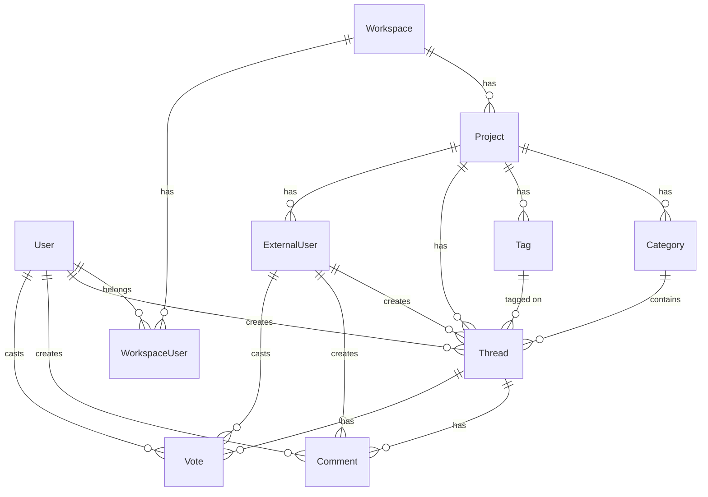

# Data Model

Vocus uses PostgreSQL with Prisma ORM for type-safe database access.

## Entity Relationship Diagram



## Core Models

### Workspace

Top-level organization unit.

```prisma
model Workspace {
  id        String   @id @default(cuid())
  name      String
  slug      String   @unique
  createdAt DateTime @default(now())
  updatedAt DateTime @updatedAt

  users    WorkspaceUser[]
  projects Project[]

  @@index([slug])
}
```

**Fields:**

- `id`: Unique workspace identifier
- `name`: Display name
- `slug`: URL-friendly identifier
- `users`: Members with roles
- `projects`: Feedback boards

### WorkspaceUser

Many-to-many relationship with roles.

```prisma
enum WorkspaceRole {
  OWNER
  ADMIN
  MEMBER
}

model WorkspaceUser {
  id          String        @id @default(cuid())
  userId      String
  workspaceId String
  role        WorkspaceRole @default(MEMBER)
  createdAt   DateTime      @default(now())

  user      User      @relation(fields: [userId], references: [id])
  workspace Workspace @relation(fields: [workspaceId], references: [id])

  @@unique([userId, workspaceId])
  @@index([workspaceId])
}
```

### User

Platform-authenticated users.

```prisma
model User {
  id            String    @id @default(cuid())
  email         String    @unique
  name          String?
  passwordHash  String?
  image         String?
  emailVerified Boolean   @default(false)
  isAnonymous   Boolean?  @default(false)
  createdAt     DateTime  @default(now())
  updatedAt     DateTime  @updatedAt

  workspaces WorkspaceUser[]
  threads    Thread[]
  comments   Comment[]
  votes      Vote[]
  sessions   Session[]
  accounts   Account[]

  @@index([email])
  @@map("user")
}
```

**Notes:**

- `emailVerified`: For platform auth
- `isAnonymous`: Flag for anonymous platform users
- `passwordHash`: Null for SSO users
- Related to Better Auth sessions/accounts

### Project

Feedback board configuration.

```prisma
enum AuthMode {
  HOST_SSO
  PLATFORM_AUTH
  HYBRID
  ANONYMOUS
}

model Project {
  id             String    @id @default(cuid())
  workspaceId    String
  name           String
  slug           String    @unique
  publicKey      String    @unique
  secretKey      String    @unique
  authMode       AuthMode  @default(HYBRID)
  allowAnonymous Boolean   @default(false)
  settingsJson   Json?
  createdAt      DateTime  @default(now())
  updatedAt      DateTime  @updatedAt

  workspace     Workspace     @relation(fields: [workspaceId])
  categories    Category[]
  tags          Tag[]
  threads       Thread[]
  externalUsers ExternalUser[]

  @@unique([workspaceId, slug])
  @@index([workspaceId])
}
```

**Key Fields:**

- `publicKey`: Client-safe identifier (`pk_` prefix)
- `secretKey`: Server-only secret (`sk_` prefix)
- `authMode`: Authentication strategy
- `allowAnonymous`: Enable anonymous feedback

### ExternalUser

SSO identity bridge.

```prisma
enum ExternalUserRole {
  USER
  ADMIN
}

model ExternalUser {
  id            String   @id @default(cuid())
  projectId     String
  externalId    String
  email         String?
  name          String?
  avatarUrl     String?
  emailVerified Boolean  @default(false)
  authProvider  AuthMode @default(HOST_SSO)
  role          ExternalUserRole @default(USER)
  banned        Boolean  @default(false)
  createdAt     DateTime @default(now())
  updatedAt     DateTime @updatedAt
  lastSeenAt    DateTime?

  project  Project @relation(fields: [projectId])
  threads  Thread[]  @relation("ExternalThreadAuthor")
  comments Comment[] @relation("ExternalCommentAuthor")
  votes    Vote[]

  @@unique([projectId, externalId])
  @@index([projectId])
}
```

**Important:**

- `externalId`: ID from host system
- `lastSeenAt`: Updated on each activity
- `banned`: Moderation flag
- Unique per `{projectId, externalId}`

### Category

Thread organization.

```prisma
model Category {
  id          String  @id @default(cuid())
  projectId   String
  name        String
  description String?
  createdAt   DateTime @default(now())
  updatedAt   DateTime @updatedAt

  project Project @relation(fields: [projectId])
  threads Thread[]

  @@unique([projectId, name])
  @@index([projectId])
}
```

### Tag

Thread tagging.

```prisma
model Tag {
  id        String  @id @default(cuid())
  projectId String
  name      String
  color     String?
  createdAt DateTime @default(now())
  updatedAt DateTime @updatedAt

  project Project @relation(fields: [projectId])
  threads Thread[]

  @@unique([projectId, name])
  @@index([projectId])
}
```

### Thread

Main feedback item.

```prisma
enum ThreadStatus {
  OPENED
  PLANNED
  IN_PROGRESS
  ANSWERED
  CLOSED
}

model Thread {
  id                  String       @id @default(cuid())
  projectId           String
  categoryId          String
  title               String
  description         String
  status              ThreadStatus @default(OPENED)
  createdAt           DateTime     @default(now())
  updatedAt           DateTime     @updatedAt

  project   Project @relation(fields: [projectId])
  category  Category @relation(fields: [categoryId])
  tags      Tag[]

  createdByUserId       String?
  createdByUser         User? @relation("InternalThreadAuthor")
  createdByExternalId   String?
  createdByExternal     ExternalUser? @relation("ExternalThreadAuthor")

  votes    Vote[]
  comments Comment[]

  @@index([projectId, status])
  @@index([projectId, createdAt])
}
```

**Author Resolution:**

- `createdByUserId`: Platform user
- `createdByExternalId`: External user
- One or the other (or null for legacy)

### Comment

Thread replies.

```prisma
model Comment {
  id                 String   @id @default(cuid())
  threadId           String
  authorUserId       String?
  authorUser         User? @relation("InternalCommentAuthor")
  authorExternalId   String?
  authorExternal     ExternalUser? @relation("ExternalCommentAuthor")
  content            String
  isInternalNote     Boolean @default(false)
  createdAt          DateTime @default(now())

  thread Thread @relation(fields: [threadId])

  @@index([threadId, createdAt])
}
```

**Features:**

- `isInternalNote`: Admin-only comments (planned)
- Dual author support (platform + external)

### Vote

Thread upvotes/downvotes.

```prisma
model Vote {
  id             String   @id @default(cuid())
  threadId       String
  userId         String?
  user           User? @relation(fields: [userId])
  externalUserId String?
  external       ExternalUser? @relation(fields: [externalUserId])
  browserId      String?
  createdAt      DateTime @default(now())

  thread Thread @relation(fields: [threadId])

  @@unique([threadId, userId, externalUserId, browserId])
  @@index([threadId])
}
```

**Unique Constraint:**

- One vote per identity per thread
- Identity: `userId` OR `externalUserId` OR `browserId`

### Better Auth Models

Session management.

```prisma
model Session {
  id        String   @id
  expiresAt DateTime
  token     String   @unique
  createdAt DateTime @default(now())
  updatedAt DateTime @updatedAt
  ipAddress String?
  userAgent String?
  userId    String
  user      User @relation(fields: [userId])

  @@index([userId])
  @@map("session")
}

model Account {
  id                    String    @id
  accountId             String
  providerId            String
  userId                String
  user                  User      @relation(fields: [userId])
  accessToken           String?
  refreshToken          String?
  idToken               String?
  accessTokenExpiresAt  DateTime?
  refreshTokenExpiresAt DateTime?
  scope                 String?
  password              String?
  createdAt             DateTime  @default(now())
  updatedAt             DateTime  @updatedAt

  @@index([userId])
  @@map("account")
}

model Verification {
  id         String   @id
  identifier String
  value      String
  expiresAt  DateTime
  createdAt  DateTime @default(now())
  updatedAt  DateTime @updatedAt

  @@index([identifier])
  @@map("verification")
}
```

## Indexes

### Performance Indexes

| Model        | Fields                 | Purpose                 |
| ------------ | ---------------------- | ----------------------- |
| User         | `email`                | Login lookup            |
| Workspace    | `slug`                 | URL routing             |
| Project      | `workspaceId`          | Workspace projects list |
| Project      | `publicKey`            | Widget project lookup   |
| ExternalUser | `projectId`            | Project users           |
| Thread       | `projectId, status`    | Status-filtered lists   |
| Thread       | `projectId, createdAt` | Chronological lists     |
| Comment      | `threadId, createdAt`  | Thread comments         |
| Vote         | `threadId`             | Vote counting           |
| Session      | `userId`               | User sessions           |
| Account      | `userId`               | User accounts           |
| Verification | `identifier`           | Email verification      |

### Unique Constraints

| Model        | Fields                                        | Purpose                          |
| ------------ | --------------------------------------------- | -------------------------------- |
| User         | `email`                                       | Unique email                     |
| Workspace    | `slug`                                        | Unique URL                       |
| Project      | `slug`                                        | Unique project URL               |
| Project      | `publicKey`                                   | Unique public key                |
| Project      | `secretKey`                                   | Unique secret key                |
| Project      | `workspaceId, slug`                           | Unique slug per workspace        |
| ExternalUser | `projectId, externalId`                       | Unique external user per project |
| Category     | `projectId, name`                             | Unique category per project      |
| Tag          | `projectId, name`                             | Unique tag per project           |
| Vote         | `threadId, userId, externalUserId, browserId` | One vote per identity            |
| Session      | `token`                                       | Unique session token             |

## Common Queries

### List Threads with Author and Counts

```typescript
const threads = await prisma.thread.findMany({
  where: { projectId },
  orderBy: { createdAt: "desc" },
  skip: (page - 1) * limit,
  take: limit,
  include: {
    createdByUser: true,
    createdByExternal: true,
    _count: {
      select: {
        votes: true,
        comments: true,
      },
    },
  },
});
```

### Upsert ExternalUser

```typescript
const externalUser = await prisma.externalUser.upsert({
  where: {
    projectId_externalId: {
      projectId,
      externalId,
    },
  },
  create: {
    projectId,
    externalId,
    email,
    name,
    avatarUrl,
    emailVerified,
    authProvider: AuthMode.HOST_SSO,
    lastSeenAt: new Date(),
  },
  update: {
    email,
    name,
    avatarUrl,
    emailVerified,
    authProvider,
    lastSeenAt: new Date(),
  },
});
```

### Create Vote with Identity

```typescript
const vote = await prisma.vote.create({
  data: {
    threadId,
    userId: identity.kind === "platform" ? identity.userId : null,
    externalUserId:
      identity.kind === "external" && !identity.browserId
        ? identity.externalUserId
        : null,
    browserId:
      identity.kind === "external" && identity.browserId
        ? identity.browserId
        : null,
  },
});
```

### Find Thread with Relations

```typescript
const thread = await prisma.thread.findUnique({
  where: { id: threadId },
  include: {
    createdByUser: true,
    createdByExternal: true,
    category: true,
    tags: true,
    comments: {
      orderBy: { createdAt: "asc" },
      include: {
        authorUser: true,
        authorExternal: true,
      },
    },
    _count: {
      select: { votes: true },
    },
  },
});
```

## Migrations

### Create Migration

```bash
pnpm prisma migrate dev --name add_external_user_fields
```

### Reset Database

```bash
pnpm prisma migrate reset
```

### Deploy to Production

```bash
pnpm prisma migrate deploy
```

## Data Integrity

### Application-Level Guards

```typescript
// Ensure exactly one identity field
const identityCount = [userId, externalUserId, browserId].filter(
  Boolean,
).length;

if (identityCount !== 1) {
  throw badRequest("Vote identity is invalid");
}
```

### Database Constraints

```prisma
// Unique vote per identity
@@unique([threadId, userId, externalUserId, browserId])

// Unique external user per project
@@unique([projectId, externalId])
```

### Transaction Boundaries

```typescript
await prisma.$transaction(async (tx) => {
  const thread = await tx.thread.create({ data });
  await tx.notification.create({
    data: { threadId: thread.id, type: "NEW_THREAD" },
  });
  return thread;
});
```

## Next Steps

- **[Security](./security.md)**: Security practices
- **[API Reference](../api-reference/overview.md)**: API documentation
- **[Services and Repositories](../developers/services-repositories.md)**: Data access patterns
