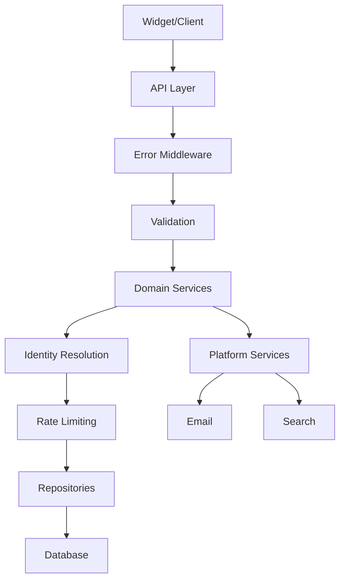

# Architecture Layers

Detailed breakdown of Vocus's five-layer architecture.

## API Layer

### Route Handlers

**Location:** `packages/server/hono/routes/*`

All API routes use Hono for lightweight, fast routing:

```typescript
// packages/server/hono/routes/embed.ts
export const embedRoutes = new Hono();

embedRoutes.get("/threads", async (c) => {
  const query = parseQuery(c, threadQuerySchema);
  const threads = await listThreads(query);
  return c.json({ threads });
});
```

### Route Structure

```
app/
├── api/
│   └── (generated routes)
├── embed/
│   └── [projectSlug]/
│       └── page.tsx          # Embed page
packages/server/hono/
├── routes/
│   ├── embed.ts              # Embed API
│   ├── widget.ts             # Legacy widget API
│   ├── admin.ts              # Admin operations
│   └── auth.ts               # Authentication
└── app.ts                    # Hono app setup
```

### Error Handling

Centralized error handling middleware:

```typescript
// packages/server/hono/middleware/error.ts
export const handleError = (err, c) => {
  if (err instanceof AppError) {
    return c.json({ error: err.message, code: err.code }, err.status);
  }
  return c.json({ error: "Internal Server Error" }, 500);
};
```

### Request Validation

All inputs validated with Zod:

```typescript
const createThreadSchema = z.object({
  projectKey: z.string().min(1),
  title: z.string().min(1).max(200),
  description: z.string().min(1),
  categoryId: z.string().optional(),
  browserId: z.string().optional(),
  userToken: z.string().optional(),
});
```

## Domain Layer

### Service Pattern

Services encapsulate business logic:

```typescript
// packages/server/services/forumService.ts

// Create a new thread
export const createThread = async (input: {
  projectId: string;
  categoryId?: string;
  title: string;
  description: string;
  identity: ResolvedIdentity;
}) => {
  // 1. Find or create default category
  const category = await categoryRepository.findOrCreateDefault(projectId);
  
  // 2. Create thread with author info
  const thread = await threadRepository.create({
    ...input,
    categoryId: category.id,
    ...applyAuthor(input.identity),
  });
  
  // 3. Map to DTO
  return mapThread(thread);
};
```

### Identity Resolution

Unified identity helper:

```typescript
// packages/server/domain/identity.ts
export const resolveWriteIdentity = async (input: ResolveIdentityInput) => {
  // Check platform session
  const session = await getPlatformSession(headers);
  
  // Check host JWT
  const token = userToken ?? getBearerToken(headers);
  
  // Resolve based on authMode
  switch (authMode) {
    case AuthMode.PLATFORM_AUTH:
      return { identity: { kind: "platform", userId: session.user.id } };
    case AuthMode.HOST_SSO:
      return { identity: { kind: "external", externalUserId } };
    case AuthMode.HYBRID:
      // Prefer platform, fallback to host, then anonymous
    case AuthMode.ANONYMOUS:
      return { identity: { kind: "external", browserId } };
  }
};
```

### Author Resolution

Consistent author output regardless of auth mode:

```typescript
// packages/server/domain/author.ts
export const resolveAuthor = (input: {
  user?: User | null;
  external?: ExternalUser | null;
}): AuthorDTO | null => {
  if (input.user) {
    return {
      id: input.user.id,
      type: "platform",
      name: input.user.name,
      email: input.user.email,
    };
  }
  
  if (input.external) {
    return {
      id: input.external.id,
      type: "external",
      name: input.external.name,
      email: input.external.email,
    };
  }
  
  return null;
};
```

## Data Layer

### Repository Pattern

Each domain has a dedicated repository:

```typescript
// packages/server/repositories/threadRepository.ts
export const threadRepository = {
  create: (data) => prisma.thread.create({
    data,
    include: { createdByUser: true, createdByExternal: true },
  }),
  
  findById: (id) => prisma.thread.findUnique({
    where: { id },
    include: { _count: { select: { votes: true, comments: true } } },
  }),
  
  listByProject: (input) => prisma.thread.findMany({
    where: { projectId: input.projectId },
    orderBy: { createdAt: "desc" },
    skip: (input.page - 1) * input.limit,
    take: input.limit,
  }),
};
```

### Transaction Boundaries

For operations requiring atomicity:

```typescript
await prisma.$transaction(async (tx) => {
  const thread = await tx.thread.create({ data });
  await tx.notification.create({ data: { threadId: thread.id } });
  return thread;
});
```

### Prisma Schema

Core models:

```prisma
model Project {
  id             String    @id @default(cuid())
  workspaceId    String
  name           String
  slug           String    @unique
  publicKey      String    @unique
  secretKey      String    @unique
  authMode       AuthMode  @default(HYBRID)
  allowAnonymous Boolean   @default(false)
}

model ExternalUser {
  id            String   @id @default(cuid())
  projectId     String
  externalId    String
  email         String?
  name          String?
  avatarUrl     String?
  lastSeenAt    DateTime?
  authProvider  AuthMode
  banned        Boolean  @default(false)
  
  @@unique([projectId, externalId])
}

model Thread {
  id                String   @id @default(cuid())
  projectId         String
  categoryId        String
  title             String
  description       String
  status            ThreadStatus
  createdByUserId   String?
  createdByExternalId String?
  
  @@index([projectId, status])
}
```

## Embed Layer

### Widget Architecture

```
packages/widget-sdk/
├── src/
│   └── index.ts          # Widget implementation
├── package.json
└── tsconfig.json

public/
└── vocus-embed.js        # Built widget script
```

### Widget Implementation

```typescript
// Simplified widget code
class VocusWidget {
  constructor(options) {
    this.publicKey = options.publicKey;
    this.userToken = options.userToken;
    this.container = document.querySelector(options.container);
    this.apiBase = options.apiBase || "";
    this.browserId = this.getBrowserId();
  }
  
  async mount() {
    const project = await this.fetchProject();
    const threads = await this.fetchThreads();
    this.render(project, threads);
  }
  
  async createThread(payload) {
    const res = await fetch(`${this.apiBase}/api/embed/threads`, {
      method: "POST",
      headers: {
        "Content-Type": "application/json",
        Authorization: this.userToken ? `Bearer ${this.userToken}` : "",
      },
      body: JSON.stringify({
        projectKey: this.publicKey,
        title: payload.title,
        description: payload.description,
        browserId: this.browserId,
      }),
    });
    return res.json();
  }
}
```

### Browser ID Management

Persistent anonymous identity:

```typescript
const STORAGE_KEY = "vocus_browser_id";

function getBrowserId() {
  try {
    const existing = localStorage.getItem(STORAGE_KEY);
    if (existing) return existing;
    
    const value = crypto.randomUUID();
    localStorage.setItem(STORAGE_KEY, value);
    return value;
  } catch (error) {
    return `anon_${Math.random().toString(36).slice(2)}`;
  }
}
```

## Platform Services

### Rate Limiting

In-memory rate limiting service:

```typescript
// packages/server/services/rateLimit.ts

type RateLimitConfig = {
  windowMs: number;
  max: number;
};

type Bucket = {
  count: number;
  resetAt: number;
};

const buckets = new Map<string, Bucket>();

export const checkRateLimit = (key: string, config: RateLimitConfig) => {
  const now = Date.now();
  const existing = buckets.get(key);
  
  if (!existing || existing.resetAt <= now) {
    buckets.set(key, { count: 1, resetAt: now + config.windowMs });
    return { allowed: true, remaining: config.max - 1 };
  }
  
  if (existing.count >= config.max) {
    return { allowed: false, remaining: 0 };
  }
  
  existing.count += 1;
  return { allowed: true, remaining: config.max - existing.count };
};
```

### Email Service

Notification delivery (stub implementation):

```typescript
// packages/server/services/notificationService.ts

export const noopNotificationService = {
  notifyThreadReply: async ({ threadId, commentId }) => {
    // TODO: Implement email notification
    console.log(`Notification: Thread ${threadId} reply ${commentId}`);
  },
  
  notifyMention: async ({ userId, mentionerId }) => {
    // TODO: Implement email notification
    console.log(`Notification: User ${userId} mentioned by ${mentionerId}`);
  },
};
```

### JWT Verification

Host SSO validation:

```typescript
// packages/server/lib/hostJWT.ts

export const verifyHostJwt = async (token: string, secretKey: string) => {
  if (!token) {
    throw unauthorized("Missing user token", "MISSING_TOKEN");
  }
  
  const key = new TextEncoder().encode(secretKey);
  
  try {
    const { payload } = await jwtVerify(token, key, {
      algorithms: ["HS256"],
      issuer: process.env.VOCUS_HOST_JWT_ISSUER,
      audience: process.env.VOCUS_HOST_JWT_AUDIENCE,
    });
    return payload;
  } catch (error) {
    throw badRequest("Invalid user token", "INVALID_TOKEN");
  }
};
```

## Layer Communication

### Request Flow



### Dependency Rules

1. **API Layer** → **Domain Services** only
2. **Domain Services** → **Repositories** and **Platform Services**
3. **Repositories** → **Prisma** only
4. **No circular dependencies**
5. **No Prisma in API layer**

## Next Steps

- **[Auth Modes](./auth-modes.md)**: Authentication strategies
- **[Data Model](./data-model.md)**: Database design
- **[Security](./security.md)**: Security architecture
