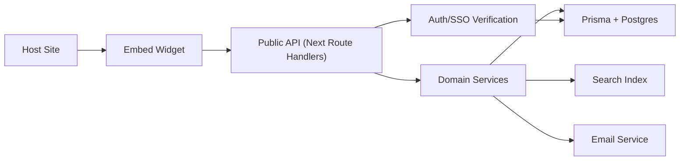
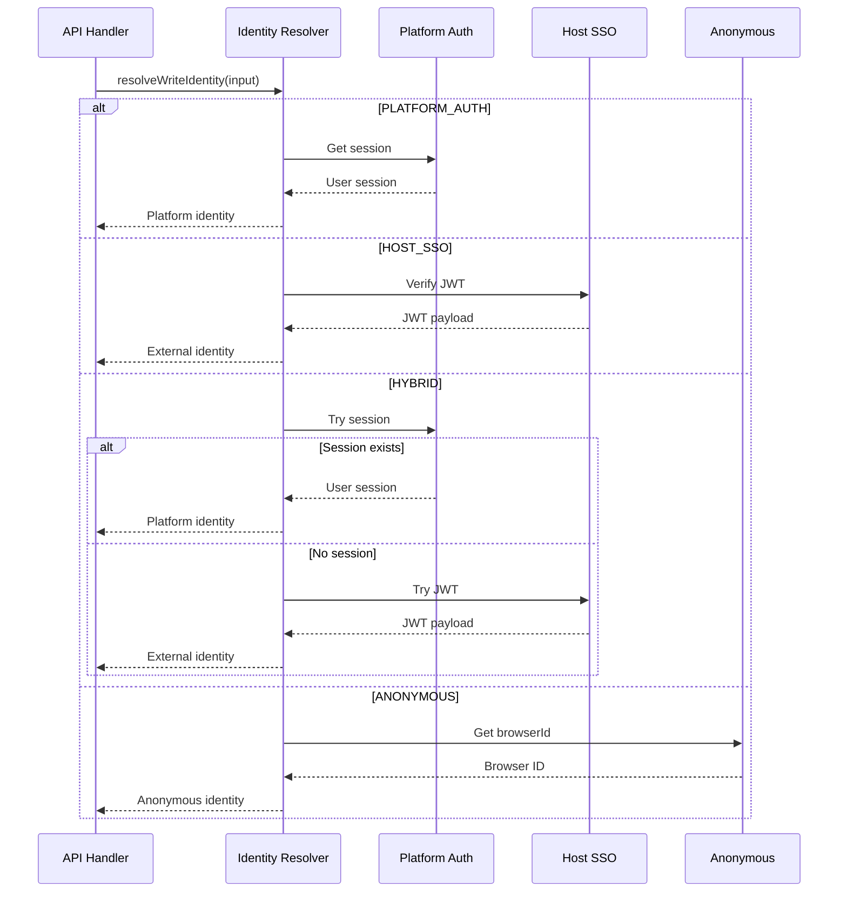
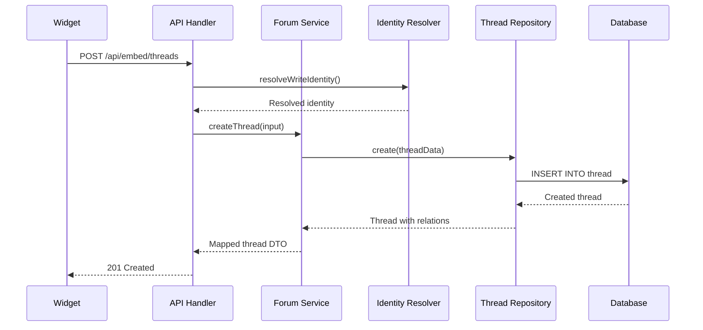

# Architecture Overview

Vocus is built with a clean, modular architecture designed for scalability and maintainability.

## System Architecture



## Five-Layer Architecture

### 1. API Layer

**Location:** `app/api/*` and `packages/server/hono/routes/*`

The API layer handles all incoming HTTP requests and is responsible for:
- Request routing
- Input validation
- Authentication/authorization
- Response formatting

**Key Features:**
- Next.js Route Handlers for public API
- Hono for lightweight routing
- CORS support for cross-origin widget requests
- Centralized error handling

**Example:**
```typescript
// app/embed/[projectSlug]/page.tsx
export const GET = async (c) => {
  const project = await getProjectBySlug(slug);
  return c.json({ project });
};
```

### 2. Domain Layer

**Location:** `packages/server/domain/*` and `packages/server/services/*`

The domain layer contains all business logic and use cases:

**Modules:**
- **Project**: Project keys, authMode, settings, embed configuration
- **ExternalUser**: SSO identity bridge for embedded contexts
- **Forum**: Thread, comment, and vote logic
- **Moderation**: Banned flags, rate limits, content policy
- **Notifications**: Email on replies and mentions

**Key Principles:**
- Services accept explicit context with identity
- No direct Prisma usage
- Reusable across different API endpoints
- Testable in isolation

**Example:**
```typescript
// packages/server/services/forumService.ts
export const createThread = async (input: {
  projectId: string;
  identity: ResolvedIdentity;
  title: string;
  description: string;
}) => {
  // Business logic here
};
```

### 3. Data Layer

**Location:** `packages/server/repositories/*` and `prisma/*`

The data layer manages database access with strict repositories:

**Components:**
- **Prisma Schema**: Type-safe database definitions
- **Repositories**: Encapsulated data access
- **Migrations**: Version-controlled schema changes
- **Transaction Boundaries**: Data integrity guarantees

**Repository Pattern:**
```typescript
// packages/server/repositories/threadRepository.ts
export const threadRepository = {
  create: (data) => prisma.thread.create({ data }),
  findById: (id) => prisma.thread.findUnique({ where: { id } }),
  listByProject: (input) => prisma.thread.findMany({ where: input }),
};
```

**Benefits:**
- Single responsibility
- Easy to test and mock
- Consistent query patterns
- Tenant scoping enforcement

### 4. Embed Layer

**Location:** `packages/widget-sdk/*` and `public/vocus-embed.js`

The embed layer provides the client-facing widget:

**Components:**
- **Widget SDK**: TypeScript widget implementation
- **Loader Script**: Hydrates widget into host DOM
- **Storage Management**: Browser ID persistence
- **API Client**: Communication with Vocus API

**Features:**
- Lightweight (< 10KB gzipped)
- No external dependencies
- CORS-enabled
- Responsive design
- Customizable styling

**Usage:**
```html
<script src="/vocus-embed.js"></script>
<script>
  window.VocusWidget?.init({
    publicKey: "pk_xxx",
    container: "#widget"
  });
</script>
```

### 5. Platform Services

**Location:** `packages/server/services/*`

Background jobs and external integrations:

**Services:**
- **Email Service**: Notification delivery
- **Search Provider**: Postgres tsvector or Algolia
- **Rate Limiter**: Request throttling
- **JWT Verification**: Host SSO validation

**Example:**
```typescript
// packages/server/services/rateLimit.ts
export const enforceRateLimit = (key, config) => {
  const result = checkRateLimit(key, config);
  if (!result.allowed) {
    throw forbidden("Rate limit exceeded");
  }
};
```

## Key Domain Modules

### Project Module

Manages project configuration and API keys:

```typescript
interface Project {
  id: string;
  workspaceId: string;
  name: string;
  slug: string;
  publicKey: string;      // Safe for client use
  secretKey: string;      // Server-side only
  authMode: AuthMode;
  allowAnonymous: boolean;
}
```

**Responsibilities:**
- Key generation (`pk_` and `sk_` prefixes)
- Auth mode enforcement
- Embed configuration
- Category and tag management

### ExternalUser Module

Bridges external identity systems:

```typescript
interface ExternalUser {
  id: string;
  projectId: string;
  externalId: string;     // From host system
  email?: string;
  name?: string;
  avatarUrl?: string;
  lastSeenAt?: DateTime;
  authProvider: AuthMode;
  banned: boolean;
}
```

**Upsert Rules:**
- Match on `{projectId, externalId}`
- Always update `lastSeenAt`
- Update `displayName`, `email`, `avatarUrl`
- Enforce uniqueness per project

### Forum Module

Core feedback functionality:

```typescript
interface Thread {
  id: string;
  projectId: string;
  categoryId: string;
  title: string;
  description: string;
  status: ThreadStatus;
  createdByUserId?: string;
  createdByExternalId?: string;
  votes: Vote[];
  comments: Comment[];
}
```

**Features:**
- Dual author support (platform + external)
- Status tracking (Open, Planned, In Progress, Answered, Closed)
- Vote counting
- Comment threading

### Moderation Module

Content policy enforcement:

```typescript
interface ModerationConfig {
  banned: boolean;           // On User and ExternalUser
  rateLimits: Map<string, Bucket>;
  auditLog: ModerationEvent[];
}
```

**Capabilities:**
- User banning
- Rate limiting by project + identity
- Content flagging (planned)
- Audit logging (planned)

### Notifications Module

Event-driven communication:

```typescript
interface NotificationService {
  notifyThreadReply: (data: {
    threadId: string;
    commentId: string;
  }) => Promise<void>;
  
  notifyMention: (data: {
    userId: string;
    mentionerId: string;
  }) => Promise<void>;
}
```

**Events:**
- Thread replies
- User mentions
- Status changes (planned)
- Project announcements (planned)

## Identity Resolution

Vocus uses a unified identity resolution system:

```typescript
type ResolvedIdentity = 
  | { kind: "platform"; userId: string }
  | { kind: "external"; externalUserId: string; provider: AuthMode; browserId?: string };
```

**Resolution Flow:**



## Data Flow Example

**Creating a Thread:**



## Security Architecture

### Key Management

- **Public Key (`pk_`)**: Safe for client-side use
- **Secret Key (`sk_`)**: Server-side only, never exposed

### JWT Validation

```typescript
// packages/server/lib/hostJWT.ts
export const verifyHostJwt = async (token, secretKey) => {
  const { payload } = await jwtVerify(token, key, {
    algorithms: ["HS256"],
    issuer: process.env.VOCUS_HOST_JWT_ISSUER,
    audience: process.env.VOCUS_HOST_JWT_AUDIENCE,
  });
  return payload;
};
```

### Rate Limiting

In-memory rate limiting with bucket algorithm:

```typescript
type Bucket = {
  count: number;
  resetAt: number;
};

const buckets = new Map<string, Bucket>();
```

## Next Steps

- **[Layers](./layers.md)**: Detailed layer breakdown
- **[Auth Modes](./auth-modes.md)**: Authentication deep dive
- **[Data Model](./data-model.md)**: Database schema
- **[Security](./security.md)**: Security practices
