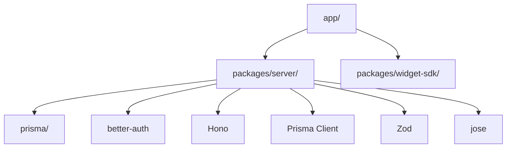

# Project Structure

Detailed overview of the Vocus codebase organization.

## Root Structure

```
vocus/
├── app/                      # Next.js application
├── packages/                 # Shared packages
├── prisma/                   # Database schema & migrations
├── docs/                     # Documentation
├── public/                   # Static assets
├── .github/                  # GitHub workflows
├── package.json              # Root package.json
├── tsconfig.json             # TypeScript config
└── pnpm-workspace.yaml       # pnpm workspace config
```

## Application Layer (`app/`)

```
app/
├── (client-sdk)/            # Client SDK routes
│   └── widget/
│       └── route.ts         # Widget script endpoint
├── embed/                   # Embeddable widget pages
│   └── [projectSlug]/
│       └── page.tsx         # Dynamic embed page
├── api/                     # Auto-generated API routes
└── generated/               # Generated code
    └── prisma/              # Prisma client output
```

### Key Files

**`app/embed/[projectSlug]/page.tsx`**
- Dynamic route for embed pages
- Server-side project lookup
- Widget initialization

**`app/(client-sdk)/widget/route.ts`**
- Serves the widget JavaScript
- CORS enabled for cross-origin requests

## Server Package (`packages/server/`)

```
packages/server/
├── domain/                  # Domain logic
│   ├── author.ts            # Author resolution
│   ├── errors.ts            # Error classes
│   ├── identity.ts          # Identity resolution
│   └── types.ts             # Domain types
├── services/                # Business logic
│   ├── projectService.ts    # Project operations
│   ├── forumService.ts      # Thread/comment/vote ops
│   ├── externalUserService.ts # External user management
│   ├── notificationService.ts # Notifications (stub)
│   ├── rateLimit.ts         # Rate limiting
│   └── search/              # Search (stub)
├── repositories/            # Data access layer
│   ├── projectRepository.ts
│   ├── threadRepository.ts
│   ├── commentRepository.ts
│   ├── voteRepository.ts
│   ├── categoryRepository.ts
│   └── externalUserRepository.ts
├── lib/                     # Utilities
│   ├── db.ts                # Prisma client
│   ├── auth.ts              # Better Auth setup
│   ├── hostJWT.ts           # JWT verification
│   ├── keys.ts              # Key generation
│   └── platformSession.ts   # Session management
└── hono/                    # Hono router
    ├── app.ts               # Hono app setup
    ├── routes/
    │   ├── embed.ts         # Embed API routes
    │   ├── widget.ts        # Widget API routes
    │   ├── admin.ts         # Admin routes
    │   └── auth.ts          # Auth routes
    ├── middleware/
    │   ├── error.ts         # Error handler
    │   └── platformAuth.ts  # Platform auth middleware
    └── validation.ts        # Request validation
```

### Domain Layer

**Purpose:** Core business logic and types

**Files:**
- `author.ts`: Resolves author information from platform or external users
- `errors.ts`: AppError class and error constructors
- `identity.ts`: Identity resolution for different auth modes
- `types.ts`: TypeScript types for domain objects

**Example:**
```typescript
// packages/server/domain/errors.ts
export class AppError extends Error {
  readonly status: ContentfulStatusCode;
  readonly code: string;
  
  constructor(status: ContentfulStatusCode, code: string, message: string) {
    super(message);
    this.status = status;
    this.code = code;
  }
}

export const badRequest = (message: string, code = "BAD_REQUEST") =>
  new AppError(400, code, message);
```

### Services Layer

**Purpose:** Business logic and use cases

**Pattern:**
- Services accept explicit context
- No direct Prisma usage
- Call repositories for data access
- Testable in isolation

**Example:**
```typescript
// packages/server/services/forumService.ts
export const createThread = async (input: {
  projectId: string;
  categoryId?: string;
  title: string;
  description: string;
  identity: ResolvedIdentity;
}) => {
  const category = input.categoryId
    ? await categoryRepository.findByIdForProject(input.projectId, input.categoryId)
    : await categoryRepository.findOrCreateDefault(input.projectId);
  
  const thread = await threadRepository.create({
    projectId: input.projectId,
    categoryId: category.id,
    title: input.title,
    description: input.description,
    ...applyAuthor(input.identity),
  });
  
  return mapThread(thread);
};
```

### Repository Layer

**Purpose:** Data access encapsulation

**Pattern:**
- One repository per aggregate
- Prisma usage isolated here
- Consistent query patterns
- Tenant scoping enforcement

**Example:**
```typescript
// packages/server/repositories/threadRepository.ts
export const threadRepository = {
  create: (data) =>
    prisma.thread.create({
      data,
      include: {
        createdByUser: true,
        createdByExternal: true,
        _count: { select: { comments: true, votes: true } },
      },
    }),
  
  findById: (id) =>
    prisma.thread.findUnique({
      where: { id },
      include: {
        createdByUser: true,
        createdByExternal: true,
        _count: { select: { comments: true, votes: true } },
      },
    }),
};
```

### Hono Routes

**Purpose:** HTTP request handling

**Pattern:**
- Route handlers call services only
- Request validation with Zod
- Centralized error handling
- No Prisma in routes

**Example:**
```typescript
// packages/server/hono/routes/embed.ts
embedRoutes.post("/threads", async (c) => {
  const body = await parseJsonBody(c, createThreadSchema);
  const project = await getProjectByPublicKey(body.projectKey);
  
  const { identity, identityKey } = await resolveWriteIdentity({
    authMode: project.authMode,
    projectId: project.id,
    secretKey: project.secretKey,
    allowAnonymous: project.allowAnonymous,
    headers: c.req.raw.headers,
    browserId: getBrowserId(c.req.raw.headers, body.browserId),
    userToken: body.userToken,
  });
  
  enforceRateLimit(`write:thread:${project.id}:${identityKey.key}`, {
    windowMs: 60_000,
    max: 20,
  });
  
  const thread = await createThread({
    projectId: project.id,
    categoryId: body.categoryId,
    title: body.title,
    description: body.description,
    identity,
  });
  
  return c.json({ thread }, 201);
});
```

## Widget SDK (`packages/widget-sdk/`)

```
packages/widget-sdk/
├── src/
│   └── index.ts           # Widget implementation
├── dist/                  # Built output
│   ├── index.js
│   └── index.d.ts
├── package.json
└── tsconfig.json
```

**Purpose:** Client-side widget code

**Features:**
- No external dependencies
- Lightweight (< 10KB gzipped)
- CORS-enabled
- Responsive design

## Database (`prisma/`)

```
prisma/
├── schema.prisma          # Database schema
├── migrations/            # Version-controlled migrations
│   └── [timestamp]_[name]/
│       └── migration.sql
└── dev.db                # Development SQLite (optional)
```

### Schema Organization

**Core Models:**
- `User`: Platform-authenticated users
- `Workspace`: Organization unit
- `Project`: Feedback board
- `ExternalUser`: SSO identity bridge
- `Thread`: Feedback item
- `Comment`: Thread reply
- `Vote`: Thread vote
- `Category`: Thread category
- `Tag`: Thread tag

**Auth Models (Better Auth):**
- `Session`: User sessions
- `Account`: OAuth accounts
- `Verification`: Email verification

## Configuration Files

### `package.json`

Root package configuration:

```json
{
  "name": "vocus",
  "version": "0.1.0",
  "private": true,
  "scripts": {
    "dev": "next dev",
    "build": "next build",
    "start": "next start",
    "prisma": "prisma",
    "lint": "eslint"
  }
}
```

### `tsconfig.json`

TypeScript configuration:

```json
{
  "compilerOptions": {
    "target": "ES2020",
    "lib": ["ES2020", "DOM", "DOM.Iterable"],
    "module": "ESNext",
    "moduleResolution": "bundler",
    "paths": {
      "@/*": ["./*"],
      "@/packages/*": ["./packages/*"]
    }
  }
}
```

### `pnpm-workspace.yaml`

pnpm workspace configuration:

```yaml
packages:
  - '.'
  - 'packages/*'
```

### `prisma.config.ts`

Prisma configuration:

```typescript
import { defineConfig } from 'prisma/config';

export default defineConfig({
  schema: 'prisma/schema.prisma',
});
```

## Import Aliases

| Alias | Resolves To |
|-------|-------------|
| `@/*` | Project root |
| `@/app/*` | `app/*` |
| `@/packages/*` | `packages/*` |
| `@/packages/server/*` | `packages/server/*` |

## Dependency Graph



## File Naming Conventions

- **Services:** `*Service.ts` (e.g., `forumService.ts`)
- **Repositories:** `*Repository.ts` (e.g., `threadRepository.ts`)
- **Routes:** `*.ts` in `routes/` directory
- **Middleware:** `*.ts` in `middleware/` directory
- **Types:** `types.ts` or `*.types.ts`
- **Tests:** `*.test.ts` or `*.spec.ts`

## Code Organization Principles

### 1. Vertical Slice Architecture

Features are organized vertically across layers:

```
Feature: Thread Creation
├── API: POST /api/embed/threads
├── Service: createThread()
├── Repository: threadRepository.create()
└── Domain: ResolvedIdentity, AuthorDTO
```

### 2. Dependency Rule

Dependencies point inward:
- Routes → Services → Repositories → Prisma
- No reverse dependencies
- No circular dependencies

### 3. Single Responsibility

Each file has one responsibility:
- Services handle business logic
- Repositories handle data access
- Routes handle HTTP concerns
- Domain handles types and rules

### 4. Explicit Boundaries

Clear boundaries between layers:
- No Prisma in routes or services
- No HTTP concerns in services
- No business logic in routes

## Next Steps

- **[Development Setup](./development-setup.md)**: Get started
- **[Services & Repositories](./services-repositories.md)**: Deep dive
- **[Testing](./testing.md)**: Testing guide
- **[Deployment](./deployment.md)**: Deploy to production
