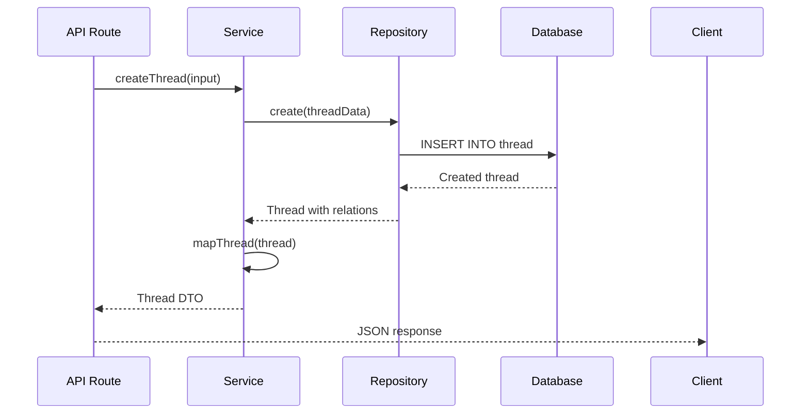

# Services and Repositories

Deep dive into the service and repository pattern used in Vocus.

## Overview

Vocus uses a layered architecture with clear separation of concerns:

```
┌─────────────────┐
│   API Routes    │  ← HTTP handling, validation
├─────────────────┤
│    Services     │  ← Business logic, use cases
├─────────────────┤
│  Repositories   │  ← Data access, Prisma
├─────────────────┤
│    Database     │  ← PostgreSQL
└─────────────────┘
```

## Service Layer

### Purpose

The service layer contains all business logic and use cases. It:

- Orchestrates data operations
- Enforces business rules
- Handles identity resolution
- Coordinates between repositories

### Service Structure

```typescript
// packages/server/services/forumService.ts

// Helper functions (private)
const applyAuthor = (identity: ResolvedIdentity) => {...}
const mapThread = (thread: Thread) => {...}

// Public service functions
export const createThread = async (input: CreateThreadInput) => {...}
export const listThreads = async (input: ListThreadsInput) => {...}
export const getThread = async (threadId: string) => {...}
export const toggleVote = async (input: ToggleVoteInput) => {...}
```

### Service Principles

**1. Accept Explicit Context**

Services receive all dependencies as parameters:

```typescript
// Recommended: Explicit parameters
export const createThread = async (input: {
  projectId: string;
  identity: ResolvedIdentity;
  title: string;
  description: string;
}) => {...}

// Avoid: Implicit dependencies
export const createThread = async (req: Request) => {...}
```

**2. No Direct Prisma**

Services call repositories, not Prisma directly:

```typescript
// Recommended: Use repositories
const thread = await threadRepository.create(data);

// Avoid: Use Prisma directly
const thread = await prisma.thread.create({ data });
```

**3. Return DTOs**

Services return mapped data transfer objects:

```typescript
// Recommended: Return DTO
return {
  id: thread.id,
  title: thread.title,
  votesCount: thread._count.votes,
  author: resolveAuthor({ ... }),
};

// ❌ DON'T: Return raw Prisma model
return thread;
```

**4. Handle Business Logic**

All business rules live in services:

```typescript
export const toggleVote = async (input) => {
  // Business rule: Ensure exactly one identity
  const identityCount = [userId, externalUserId, browserId].filter(
    Boolean,
  ).length;

  if (identityCount !== 1) {
    throw badRequest("Vote identity is invalid");
  }

  // ... rest of logic
};
```

### Service Examples

**Project Service:**

```typescript
// packages/server/services/projectService.ts

export const createProject = async (input: {
  workspaceId: string;
  name: string;
  slug: string;
  authMode?: AuthMode;
  allowAnonymous?: boolean;
}) => {
  // Business logic: Generate unique keys
  for (let attempt = 0; attempt < MAX_KEY_ATTEMPTS; attempt++) {
    const { publicKey, secretKey } = generateProjectKeys();
    try {
      return await projectRepository.create({
        ...input,
        publicKey,
        secretKey,
      });
    } catch (error) {
      if (isUniqueConstraintError(error)) {
        continue; // Try new keys
      }
      throw error;
    }
  }

  throw conflict("Failed to generate unique keys");
};

export const getProjectByPublicKey = async (publicKey: string) => {
  const project = await projectRepository.findByPublicKey(publicKey);
  if (!project) throw notFound("Project not found");
  return project;
};
```

**External User Service:**

```typescript
// packages/server/services/externalUserService.ts

export const upsertExternalUserFromToken = async (input: {
  projectId: string;
  secretKey: string;
  token: string;
}) => {
  // Verify JWT
  const payload = await verifyHostJwt(input.token, input.secretKey);
  const externalId = payload.sub ?? payload.externalId ?? payload.id;

  if (!externalId) {
    throw badRequest("Token missing subject");
  }

  // Upsert user
  return externalUserRepository.upsertByExternalId({
    projectId: input.projectId,
    externalId,
    email: payload.email,
    name: payload.name,
    avatarUrl: payload.avatarUrl,
    emailVerified: payload.emailVerified,
    authProvider: AuthMode.HOST_SSO,
  });
};
```

## Repository Layer

### Purpose

The repository layer encapsulates all data access. It:

- Provides a consistent API for data operations
- Encapsulates Prisma queries
- Enforces tenant scoping
- Handles data relationships

### Repository Structure

```typescript
// packages/server/repositories/threadRepository.ts

export const threadRepository = {
  // Create operations
  create: (data: CreateInput) => prisma.thread.create({ ... }),

  // Read operations
  findById: (id: string) => prisma.thread.findUnique({ ... }),
  listByProject: (input: ListInput) => prisma.thread.findMany({ ... }),

  // Update operations
  update: (id: string, data: UpdateInput) => prisma.thread.update({ ... }),

  // Delete operations
  delete: (id: string) => prisma.thread.delete({ ... }),
};
```

### Repository Principles

**1. Encapsulate Prisma**

All Prisma usage is isolated to repositories:

```typescript
// Recommended: Prisma only in repositories
export const threadRepository = {
  create: (data) => prisma.thread.create({ data }),
};

// Avoid: Prisma in services or routes
```

**2. Include Relations**

Repositories handle relationship loading:

```typescript
// Recommended: Include relations
findById: (id) =>
  prisma.thread.findUnique({
    where: { id },
    include: {
      createdByUser: true,
      createdByExternal: true,
      _count: { select: { votes: true, comments: true } },
    },
  });
```

**3. Enforce Tenant Scoping**

Always scope queries by tenant (project):

```typescript
// Recommended: Scope by project
listByProject: (input) =>
  prisma.thread.findMany({
    where: {
      projectId: input.projectId, // Tenant scoping
      ...input.filters,
    },
  });

// Avoid: Allow cross-tenant access
listAll: () => prisma.thread.findMany(); // Security risk!
```

**4. Handle Pagination**

Built-in pagination support:

```typescript
listByProject: (input) =>
  prisma.thread.findMany({
    where: { projectId: input.projectId },
    skip: (input.page - 1) * input.limit,
    take: input.limit,
    orderBy: { createdAt: "desc" },
  });
```

### Repository Examples

**Project Repository:**

```typescript
// packages/server/repositories/projectRepository.ts

export const projectRepository = {
  findByPublicKey: (publicKey: string) =>
    prisma.project.findUnique({
      where: { publicKey },
      include: {
        categories: { select: { id: true, name: true } },
        tags: { select: { id: true, name: true, color: true } },
      },
    }),

  findBySlug: (slug: string) =>
    prisma.project.findUnique({
      where: { slug },
      include: {
        categories: { select: { id: true, name: true } },
        tags: { select: { id: true, name: true, color: true } },
      },
    }),

  create: (data: CreateInput) =>
    prisma.project.create({
      data: {
        ...data,
        allowAnonymous: data.allowAnonymous ?? false,
      },
    }),

  listByWorkspace: (workspaceId: string) =>
    prisma.project.findMany({
      where: { workspaceId },
      orderBy: { createdAt: "desc" },
    }),
};
```

**Vote Repository:**

```typescript
// packages/server/repositories/voteRepository.ts

export const voteRepository = {
  findByIdentity: (input: {
    threadId: string;
    userId?: string | null;
    externalUserId?: string | null;
    browserId?: string | null;
  }) =>
    prisma.vote.findUnique({
      where: {
        threadId_userId_externalUserId_browserId: {
          threadId: input.threadId,
          userId: input.userId ?? null,
          externalUserId: input.externalUserId ?? null,
          browserId: input.browserId ?? null,
        },
      },
    }),

  create: (input: CreateInput) =>
    prisma.vote.create({
      data: {
        threadId: input.threadId,
        userId: input.userId ?? undefined,
        externalUserId: input.externalUserId ?? undefined,
        browserId: input.browserId ?? undefined,
      },
    }),

  deleteById: (id: string) => prisma.vote.delete({ where: { id } }),
};
```

## Service-Repository Interaction

### Typical Flow



### Example: Create Thread

**Route Handler:**

```typescript
// packages/server/hono/routes/embed.ts

embedRoutes.post("/threads", async (c) => {
  const body = await parseJsonBody(c, createThreadSchema);
  const project = await getProjectByPublicKey(body.projectKey);

  const { identity } = await resolveWriteIdentity({
    authMode: project.authMode,
    projectId: project.id,
    secretKey: project.secretKey,
    headers: c.req.raw.headers,
    userToken: body.userToken,
  });

  const thread = await createThread({
    projectId: project.id,
    categoryId: body.categoryId,
    title: body.title,
    description: body.description,
    identity,
  });

  return c.json({ thread }, 201);
});
```

**Service:**

```typescript
// packages/server/services/forumService.ts

export const createThread = async (input) => {
  // 1. Find or create category
  const category = input.categoryId
    ? await categoryRepository.findByIdForProject(
        input.projectId,
        input.categoryId,
      )
    : await categoryRepository.findOrCreateDefault(input.projectId);

  if (!category) {
    throw notFound("Category not found");
  }

  // 2. Create thread via repository
  const thread = await threadRepository.create({
    projectId: input.projectId,
    categoryId: category.id,
    title: input.title,
    description: input.description,
    ...applyAuthor(input.identity),
  });

  // 3. Map to DTO
  return mapThread(thread);
};
```

**Repository:**

```typescript
// packages/server/repositories/threadRepository.ts

export const threadRepository = {
  create: (data) =>
    prisma.thread.create({
      data,
      include: {
        createdByUser: true,
        createdByExternal: true,
        _count: { select: { votes: true, comments: true } },
      },
    }),
};
```

## Testing

### Testing Services

Mock repositories:

```typescript
// tests/unit/services/forumService.test.ts

describe("createThread", () => {
  it("should create thread with platform user", async () => {
    // Arrange
    const mockCategory = { id: "cat_1", projectId: "proj_1" };
    const mockThread = {
      id: "thread_1",
      title: "Test",
      createdByUser: { id: "user_1", name: "Test User" },
      _count: { votes: 0, comments: 0 },
    };

    categoryRepository.findByIdForProject = vi
      .fn()
      .mockResolvedValue(mockCategory);
    threadRepository.create = vi.fn().mockResolvedValue(mockThread);

    // Act
    const result = await createThread({
      projectId: "proj_1",
      title: "Test",
      description: "Test desc",
      identity: { kind: "platform", userId: "user_1" },
    });

    // Assert
    expect(result).toEqual({
      id: "thread_1",
      title: "Test",
      votesCount: 0,
      author: { type: "platform", name: "Test User" },
    });
  });
});
```

### Testing Repositories

Use test database:

```typescript
// tests/integration/repositories/threadRepository.test.ts

describe("threadRepository", () => {
  beforeEach(async () => {
    await prisma.thread.deleteMany();
    await prisma.project.deleteMany();
  });

  it("should create thread with author", async () => {
    // Arrange
    const project = await prisma.project.create({
      data: {
        workspaceId: "ws_1",
        name: "Test",
        slug: "test",
        publicKey: "pk_1",
        secretKey: "sk_1",
      },
    });

    // Act
    const thread = await threadRepository.create({
      projectId: project.id,
      categoryId: "cat_1",
      title: "Test Thread",
      description: "Test description",
      createdByUserId: "user_1",
    });

    // Assert
    expect(thread).toMatchObject({
      id: expect.any(String),
      title: "Test Thread",
      createdByUserId: "user_1",
      _count: { votes: 0, comments: 0 },
    });
  });
});
```

## Best Practices

### 1. Keep Services Focused

Each service should have a single responsibility:

```typescript
// Recommended: Focused service
export const createThread = async (input) => {...}
export const listThreads = async (input) => {...}

// Avoid: God service
export const handleEverything = async (input) => {
  // 500 lines of mixed logic
}
```

### 2. Use Transactions

For atomic operations:

```typescript
// Recommended: Use transactions
await prisma.$transaction(async (tx) => {
  const thread = await tx.thread.create({ data });
  await tx.notification.create({ data: { threadId: thread.id } });
  return thread;
});
```

### 3. Handle Errors Gracefully

```typescript
// Recommended: Handle errors
try {
  return await repository.create(data);
} catch (error) {
  if (isUniqueConstraintError(error)) {
    throw conflict("Resource already exists");
  }
  throw error;
}
```

### 4. Document Input/Output

```typescript
// Recommended: Document types
interface CreateThreadInput {
  projectId: string;
  categoryId?: string;
  title: string;
  description: string;
  identity: ResolvedIdentity;
}

interface CreateThreadOutput {
  id: string;
  title: string;
  votesCount: number;
  author: AuthorDTO;
}

export const createThread = async (input: CreateThreadInput): Promise<CreateThreadOutput> => {...}
```

## Next Steps

- **[Testing](./testing.md)**: Testing guide
- **[Deployment](./deployment.md)**: Deployment guide
- **[API Reference](../api-reference/overview.md)**: API documentation
