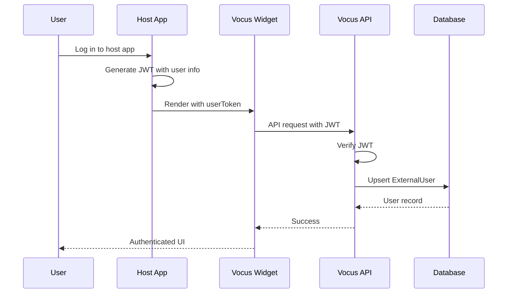

# SSO Integration

Integrate Vocus with your existing authentication system using Host SSO.

## Overview

Host SSO allows your existing users to seamlessly interact with the Vocus widget using their current credentials.

**Benefits:**

- No additional login required
- Unified user identity
- Consistent user experience
- Full user profile sync

## How It Works



## Step 1: Configure Project

Set auth mode to HOST_SSO or HYBRID:

```bash
curl -X POST http://localhost:3000/api/admin/projects \
  -H "Content-Type: application/json" \
  -d '{
    "workspaceId": "workspace_xxx",
    "name": "My Feedback",
    "slug": "my-feedback",
    "authMode": "HOST_SSO",
    "allowAnonymous": false
  }'
```

Save the `secretKey` for JWT signing.

## Step 2: Configure Environment

Set JWT validation options in Vocus:

```bash
VOCUS_HOST_JWT_ISSUER="your-app-name"
VOCUS_HOST_JWT_AUDIENCE="vocus-feedback"
```

## Step 3: Generate JWT

### Node.js Example

```typescript
import { SignJWT } from "jose";

const secretKey = new TextEncoder().encode("sk_your_secret_key");

async function generateUserToken(user) {
  return new SignJWT({
    sub: user.id,
    email: user.email,
    name: user.name,
    avatarUrl: user.avatarUrl,
    emailVerified: user.emailVerified,
  })
    .setProtectedHeader({ alg: "HS256" })
    .setIssuedAt()
    .setExpirationTime("24h")
    .setIssuer(process.env.VOCUS_HOST_JWT_ISSUER)
    .setAudience(process.env.VOCUS_HOST_JWT_AUDIENCE)
    .sign(secretKey);
}

// Usage in your app
const token = await generateUserToken(currentUser);
res.render("page", { userToken: token });
```

### Python Example

```python
import jwt
import datetime

def generate_user_token(user, secret_key):
    payload = {
        'sub': user['id'],
        'email': user['email'],
        'name': user['name'],
        'avatarUrl': user.get('avatar_url'),
        'emailVerified': user.get('email_verified', False),
        'iss': 'your-app-name',
        'aud': 'vocus-feedback',
        'iat': datetime.datetime.utcnow(),
        'exp': datetime.datetime.utcnow() + datetime.timedelta(hours=24)
    }

    token = jwt.encode(payload, secret_key, algorithm='HS256')
    return token

# Usage
token = generate_user_token(current_user, 'sk_your_secret_key')
```

### Ruby Example

```ruby
require 'jwt'

def generate_user_token(user, secret_key)
  payload = {
    sub: user[:id],
    email: user[:email],
    name: user[:name],
    avatarUrl: user[:avatar_url],
    emailVerified: user[:email_verified] || false,
    iss: 'your-app-name',
    aud: 'vocus-feedback',
    iat: Time.now.to_i,
    exp: (Time.now + 24 * 3600).to_i
  }

  JWT.encode(payload, secret_key, 'HS256')
end

# Usage
token = generate_user_token(current_user, 'sk_your_secret_key')
```

### PHP Example

```php
use Firebase\JWT\JWT;

function generateUserToken($user, $secretKey) {
    $payload = [
        'sub' => $user['id'],
        'email' => $user['email'],
        'name' => $user['name'],
        'avatarUrl' => $user['avatar_url'] ?? null,
        'emailVerified' => $user['email_verified'] ?? false,
        'iss' => 'your-app-name',
        'aud' => 'vocus-feedback',
        'iat' => time(),
        'exp' => time() + (24 * 3600)
    ];

    return JWT::encode($payload, $secretKey, 'HS256');
}

// Usage
$token = generateUserToken($currentUser, 'sk_your_secret_key');
```

## Step 4: Embed Widget with Token

### Server-Side Rendering

```html
<!-- EJS Template -->
<script>
  window.VocusWidget?.init({
    publicKey: "<%= publicKey %>",
    container: "#vocus-widget",
    userToken: "<%= userToken %>",
  });
</script>

<!-- Pug Template -->
script. window.VocusWidget?.init({ publicKey: "#{publicKey}", container:
"#vocus-widget", userToken: "#{userToken}" });

<!-- Handlebars Template -->
<script>
  window.VocusWidget?.init({
    publicKey: "{{publicKey}}",
    container: "#vocus-widget",
    userToken: "{{userToken}}",
  });
</script>
```

### Client-Side Rendering

```jsx
// React
function FeedbackWidget({ user }) {
  const [token, setToken] = useState(null);

  useEffect(() => {
    if (user) {
      fetchUserToken(user.id).then(setToken);
    }
  }, [user]);

  useEffect(() => {
    if (token && widgetRef.current) {
      window.VocusWidget?.init({
        publicKey: process.env.REACT_APP_VOCUS_PUBLIC_KEY,
        container: widgetRef.current,
        userToken: token,
      });
    }
  }, [token]);

  return <div ref={widgetRef} />;
}
```

## JWT Payload Specification

```typescript
interface HostJwtPayload {
  // User Identification (at least one required)
  sub?: string; // Primary: User ID
  id?: string; // Alternative: User ID
  externalId?: string; // Alternative: User ID

  // User Profile (optional)
  email?: string;
  name?: string;
  avatarUrl?: string;
  emailVerified?: boolean;

  // JWT Standard Fields
  iss?: string; // Issuer (validated if configured)
  aud?: string; // Audience (validated if configured)
  exp: number; // Expiration (always validated)
  iat: number; // Issued at
}
```

### Required Fields

At least one identification field:

- `sub` (recommended)
- `id` (alternative)
- `externalId` (alternative)

### Recommended Fields

For better user experience:

- `email`: User email
- `name`: Display name
- `avatarUrl`: Profile image URL
- `emailVerified`: Email verification status

## User Synchronization

Vocus automatically syncs user data:

```typescript
// On each request with JWT
const payload = await verifyHostJwt(token, secretKey);

// Upsert ExternalUser
await externalUserRepository.upsertByExternalId({
  projectId,
  externalId: payload.sub,
  email: payload.email,
  name: payload.name,
  avatarUrl: payload.avatarUrl,
  emailVerified: payload.emailVerified,
  lastSeenAt: new Date(), // Always updated
});
```

**Sync Behavior:**

- Create user if not exists
- Update profile on changes
- Update `lastSeenAt` on each request
- Match on `{projectId, externalId}`

## Auth Mode Comparison

### HOST_SSO Mode

```json
{
  "authMode": "HOST_SSO",
  "allowAnonymous": false
}
```

**Behavior:**

- Requires valid JWT
- No anonymous access
- No platform auth

### HYBRID Mode (Recommended)

```json
{
  "authMode": "HYBRID",
  "allowAnonymous": true
}
```

**Behavior:**

1. Try platform session first
2. Fallback to host JWT
3. Fallback to anonymous (if enabled)

## Security Best Practices

### 1. Use Strong Secrets

```typescript
// Recommended: Generate secure secret
const secretKey = crypto.randomBytes(32).toString("hex");

// Avoid: Use weak secret
const secretKey = "password123";
```

### 2. Set Reasonable Expiration

```typescript
// Recommended: 24 hours
.setExpirationTime('24h')

// Avoid: Too long
.setExpirationTime('365d')

// Avoid: No expiration
// Missing .setExpirationTime()
```

### 3. Validate Issuer and Audience

```typescript
// Recommended: Set and validate
.setIssuer('your-app')
.setAudience('vocus')

// Vocus validates on verification
await jwtVerify(token, key, {
  issuer: 'your-app',
  audience: 'vocus'
});
```

### 4. Use HTTPS

```bash
// Recommended: Use HTTPS in production
NEXT_PUBLIC_APP_URL="https://vocus.yourdomain.com"

// Avoid: Use HTTP for JWT transmission
NEXT_PUBLIC_APP_URL="http://vocus.yourdomain.com"
```

## Testing

### Generate Test Token

```typescript
const testToken = await new SignJWT({
  sub: "test-user-123",
  email: "test@example.com",
  name: "Test User",
})
  .setProtectedHeader({ alg: "HS256" })
  .setExpirationTime("1h")
  .sign(new TextEncoder().encode("sk_test_secret"));

console.log("Test Token:", testToken);
```

### Test JWT Verification

```bash
# Decode token (https://jwt.io)
# Verify signature with secret
# Check expiration
```

### Test Widget

```javascript
// In browser console
window.VocusWidget?.init({
  publicKey: "pk_xxx",
  container: "#vocus-widget",
  userToken: "your_test_token",
});

// Should show authenticated UI
// User name should appear
// Actions should work
```

## Troubleshooting

### Token Validation Fails

**Check:**

1. Secret key matches
2. Algorithm is HS256
3. Token not expired
4. Issuer/audience match (if configured)

**Debug:**

```typescript
try {
  const payload = await verifyHostJwt(token, secretKey);
  console.log("Valid:", payload);
} catch (error) {
  console.error("Invalid:", error.message);
}
```

### User Not Created

**Check:**

1. JWT has `sub`, `id`, or `externalId`
2. Project exists
3. Database connection working

**Debug:**

```typescript
// Check ExternalUser table
const user = await prisma.externalUser.findUnique({
  where: {
    projectId_externalId: {
      projectId: "proj_xxx",
      externalId: "user_xxx",
    },
  },
});
```

### Token Exposed in Source

**Fix:**

```html
<!-- Avoid: Hardcode token -->
<script>
  const userToken = "eyJhbGc..."; // NEVER!
</script>

<!-- Recommended: Generate server-side -->
<script>
  const userToken = "<%= userToken %>";
</script>
```

## Next Steps

- **[Customization](./customization.md)**: Customize widget
- **[Security](../architecture/security.md)**: Security practices
- **[Advanced](../advanced/overview.md)**: Advanced topics
